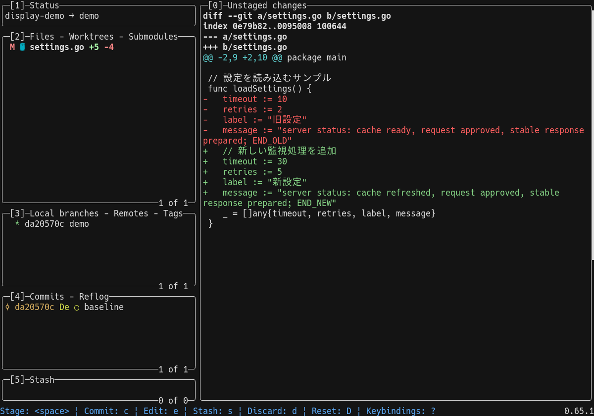
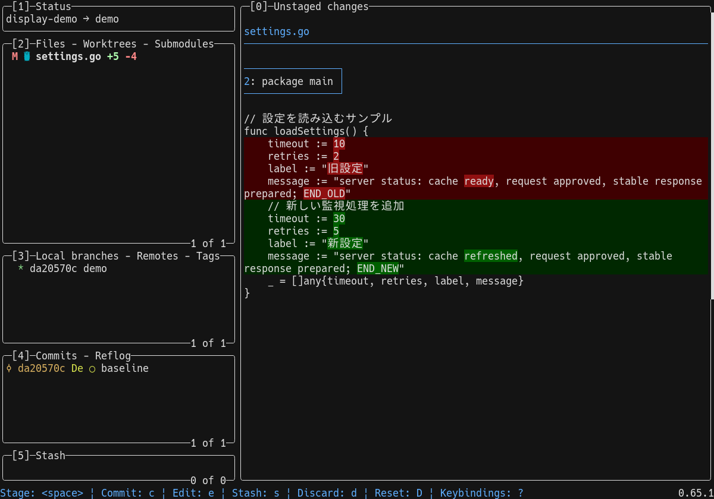
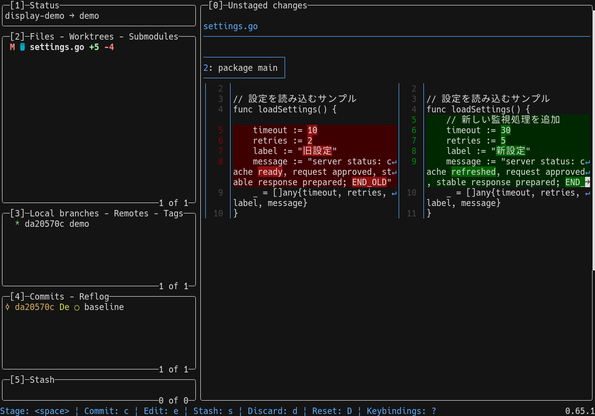
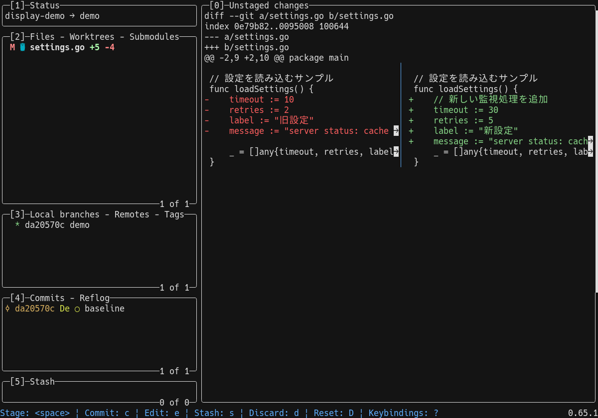
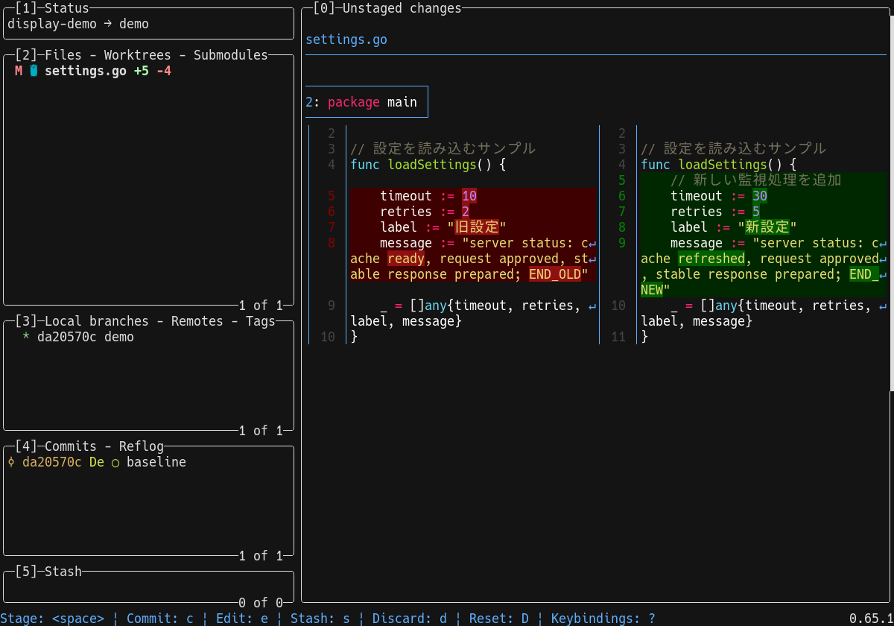

# lazygit 設定ファイル

[lazygit](https://github.com/jesseduffield/lazygit) を便利に使うための設定ファイル([`config.yml`](config.yml))です。

[設定内容・ブランチ構成](docs/reference/readme.md) / [検証記録](docs/verification/readme.md)

## 前提ツール

この設定は以下を有効化した状態になっています。未導入の場合はインストールするか、該当設定を無効化してください。

| ツール | 用途 | 未導入の場合 |
| --- | --- | --- |
| [Nerd Fonts](https://www.nerdfonts.com/)(v3系) | ファイルアイコン等の表示 | `gui.nerdFontsVersion` を `""` にする |
| [git-delta](https://github.com/dandavison/delta) | 左右比較と単語単位の変更強調を含む差分表示 | `git.diffRenderers` を `[]` に戻す |

## 導入方法

`config.yml` を lazygit の設定ディレクトリに配置します(ディレクトリは `lazygit --print-config-dir` で確認できます)。

| OS | 配置場所 |
| --- | --- |
| Linux | `~/.config/lazygit/config.yml` |
| macOS | `~/Library/Application Support/lazygit/config.yml` |
| Windows | `%LOCALAPPDATA%\lazygit\config.yml` |

このリポジトリをクローンしてシンボリックリンクを張る場合(Linux の例):

```sh
git clone https://github.com/ryo-aoki-pc/lazygit.git ~/lazygit-config
mkdir -p ~/.config/lazygit
ln -sf ~/lazygit-config/config.yml ~/.config/lazygit/config.yml
```

このリポジトリを設定ディレクトリに直接クローンする場合(Windows の例。lazygit を終了してから Windows PowerShell に貼り付けます):

```powershell
$d = "$env:LOCALAPPDATA\lazygit"
if (Test-Path -LiteralPath "$d.bak") {
  Write-Warning "$d.bak がすでにあるため中止しました。中身を確かめて片付けてから、貼り直してください"
} else {
  if (Test-Path -LiteralPath $d) { Move-Item -LiteralPath $d -Destination "$d.bak" -ErrorAction Stop; "moved: $d -> $d.bak" }
  git clone https://github.com/ryo-aoki-pc/lazygit.git $d
  git -C $d branch --show-current
  lazygit --print-config-dir
}
```

- Windows ではシンボリックリンクの作成に開発者モードか管理者権限が必要なため、リンクではなく設定ディレクトリ `%LOCALAPPDATA%\lazygit` に直接クローンします
- 既存の `%LOCALAPPDATA%\lazygit`(以前の設定と状態ファイル)は `lazygit.bak` に退避します。`lazygit.bak` がすでにある場合は、退避もクローンもせずに警告を出して止まります
- `custom`(既定のブランチ)と `C:\Users\<ユーザー名>\AppData\Local\lazygit` が表示されれば完了です
- Windows の lazygit は状態ファイル(`state.yml` など)も同じフォルダーに作りますが、[`.gitignore`](.gitignore) で `state.yml`・`github_pull_requests.json`・`development.log` を除外しているため、`git status` には出ません
- Windows の実機ではまだ実行していません。確認した範囲は[検証記録](docs/verification/readme.md#editinterminal-と-windows-向け手順の確認2026-10-08)に記載しています
- 元に戻す場合は、lazygit を終了し、次の 1 つ目のブロックで何も表示されない(未コミット・未 push の変更が無い)ことを確かめてから、2 つ目のブロックを貼り付けます

```powershell
$d = "$env:LOCALAPPDATA\lazygit"
git -C $d status --short
git -C $d log --oneline '@{u}..'
```

```powershell
$d = "$env:LOCALAPPDATA\lazygit"
Remove-Item -LiteralPath $d -Recurse -Force
if (Test-Path -LiteralPath "$d.bak") { Move-Item -LiteralPath "$d.bak" -Destination $d }
```

ファイルを置かずに一時的に試す場合:

```sh
lazygit --use-config-file ~/lazygit-config/config.yml
```

## delta の設定と表示

このリポジトリの `config.yml` は、構文ハイライトを省いた左右比較を使用しています。以下は、速度優先・見やすさ優先・内蔵表示を切り替えて使うための設定例です。

### 設定手順

1. `delta --version` で導入を確認します。Homebrew を使う場合は `brew install git-delta`、Windows の scoop では `scoop install delta` で導入できます(Windows は[Windows で使う場合](#windows-で使う場合)も参照)。
2. `lazygit --print-config-dir` で設定ディレクトリを確認し、その中の `config.yml` を開きます。既存の `git.diffRenderers` を下の3項目に置き換えます。`git:` がすでにある場合は、その中に設定してください。
3. 保存後に lazygit を終了して再起動します。

```yaml
git:
  diffRenderers:
    - command: >-
        delta --no-gitconfig --dark --paging=never --syntax-theme=none --tabs=4 --side-by-side
        --raw --inspect-raw-lines=false --word-diff-regex='(?s).+' --max-line-distance=1
        --line-numbers-left-format='' --line-numbers-right-format='│ ' --wrap-max-lines=0
      colorArg: never
      name: delta side-by-side fast
    - command: >-
        delta --no-gitconfig --dark --paging=never --tabs=4 --side-by-side --line-numbers
        --syntax-theme='Monokai Extended' --wrap-max-lines=unlimited
      name: delta side-by-side readable
    - type: rawGit
      name: default
```

起動時は最初の `delta side-by-side fast` が選ばれます。`|` キーを押すたびに、速度優先 → 見やすさ優先 → 内蔵表示 → 速度優先の順に切り替わります。見やすさ優先を初期表示にする場合は、`delta side-by-side readable` の項目を `diffRenderers` 配列の先頭に移動してください。

共通の `--no-gitconfig` は Git 側の delta 設定を読み込まず、この設定例の表示を使います。`--paging=never` は外部ページャを起動せず、`--tabs=4` は lazygit のタブ幅に揃えます。ダーク背景向けのため、ライト背景の端末では両方の `--dark` を `--light` にし、見やすさ優先の構文テーマを `--syntax-theme=GitHub` に変更してください。

左右比較では変更前が左、変更後が右に並びます。表示幅が足りない場合は、`0` キーで差分ビューにフォーカスし、`+` キーで拡大してください。ファイル一覧やコミットの差分閲覧で有効です。lazygit 0.66.0 では、Enter で差分ビューに入り、delta 0.20.1 の表示を保ったまま行・ハンクを選択できます。lazygit 0.65.1 では、Enter で入るステージング画面は内蔵表示になります。

### Windows で使う場合

Windows の lazygit は、描画のコマンドを `cmd /s /c "<コマンド>"`(cmd.exe)で実行します。cmd.exe も delta.exe の引数の解釈も単一引用符 `'…'` を引用符として扱わないため、`'` が値に残ったり、空白で引数が分かれたりします。上の設定例は、単一引用符を二重引用符に置き換えた次の形で使ってください。

```yaml
git:
  diffRenderers:
    - command: >-
        delta --no-gitconfig --dark --paging=never --syntax-theme=none --tabs=4 --side-by-side
        --raw --inspect-raw-lines=false --word-diff-regex="(?s).+" --max-line-distance=1
        --line-numbers-left-format="" --line-numbers-right-format="│ " --wrap-max-lines=0
      colorArg: never
      name: delta side-by-side fast
    - command: >-
        delta --no-gitconfig --dark --paging=never --tabs=4 --side-by-side --line-numbers
        --syntax-theme="Monokai Extended" --wrap-max-lines=unlimited
      name: delta side-by-side readable
    - type: rawGit
      name: default
```

二重引用符の形は、Linux でも単一引用符の形と同じ表示になります。このリポジトリの `config.yml` の delta の行は引用符を使っていないため、Windows でも書き換えは不要です。

Windows の `delta.exe` は Visual C++ ランタイム(`VCRUNTIME140.dll`)を必要とします。scoop の `delta` はランタイムを含まないため、PowerShell で `Test-Path "$env:WINDIR\System32\vcruntime140.dll"` が `False` の場合は、先に [Visual C++ 再頒布可能パッケージ](https://learn.microsoft.com/ja-jp/cpp/windows/latest-supported-vc-redist)の X64 版を入れてから(インストールには管理者の承認が要ります。winget では `winget install --exact --id Microsoft.VCRedist.2015+.x64`)、delta を入れてください。

```powershell
scoop install delta
delta --version
```

Windows 11 の実機で、scoop の delta 0.20.1 と、同梱の `config.yml`・上の二重引用符の形の表示を確認しました。単一引用符の形は表示が崩れます。結果は[検証記録](docs/verification/readme.md#windows-と-raspberry-pi-の実機での検証2026-10-08)に記載しています。

### 速度を最優先にする設定

`delta side-by-side fast` は、確認した候補の中で表示速度を優先した設定です。構文ハイライト、行番号、単語単位の強調を省き、`--raw` で追加・削除を緑・赤の文字と `+/-` で表示します。`colorArg: never` と `--inspect-raw-lines=false` で Git の色入力と色移動の検査を省きます。

`--word-diff-regex='(?s).+'` は一行をまとめて扱い、`--max-line-distance=1` はバッファ内の削除行と追加行を出現順に対応付けます。似た行を探して対応付ける処理を減らすため、追加行が途中に挟まる場合などは、変更前後の対応がずれることがあります。行バッファは既定値32を使用します。

`--wrap-max-lines=0` は折り返しを止め、列幅に収まらない部分を省略します。長い行の末尾を確認する場合は差分ビューを拡大するか、見やすさ優先へ切り替えてください。

全文処理時間の比較と測定条件は[検証記録](docs/verification/readme.md#delta-の表示と性能の検証)を参照してください。Windows では git と delta の起動に時間がかかるため、小さな差分でも lazygit での表示に 0.4 秒前後かかります([Windows と Raspberry Pi の測定](docs/verification/readme.md#表示の速さ))。

### 見やすさを優先する設定

`delta side-by-side readable` は、行番号、`Monokai Extended` による構文ハイライト、単語単位の変更強調を表示します。行の類似度による対応付けは既定値を使い、途中に追加行がある場合も対応する変更前後の行を探します。

`--wrap-max-lines=unlimited` で長い行を末尾まで折り返します。表示を増やして内容を確認しやすくする設定のため、構文解析や長い行の描画に時間がかかります。大きな差分を素早く切り替える場合は、速度優先または `default` を選んでください。

### 表示の比較

同じファイルの差分を、120列×40行の lazygit 画面で比較しています。ダーク背景と HackGen Console NF を使用し、コマンドログを非表示にしています。

**内蔵表示** — 追加・削除の行を Git の色分けで表示します。



**軽量deltaの通常表示** — 構文ハイライトを省いて変更前後を一列に並べ、変更した単語を強調します。



**同梱設定の軽量な左右比較** — 構文ハイライトを省き、行番号と単語単位の強調を残した左右比較です。リポジトリの `config.yml` はこの設定を使用しています。



**速度優先の左右比較** — 行番号と単語単位の強調を省き、変更行を順番に並べます。長い行は列幅で省略します。



**見やすさ優先の左右比較** — 構文ハイライト、行番号、単語単位の強調を使い、長い行を折り返します。



設定形式と切替操作は [lazygit の公式資料](https://github.com/jesseduffield/lazygit/blob/v0.66.0/docs/Custom_DiffRenderers.md)、左右比較は [delta の公式資料](https://dandavison.github.io/delta/side-by-side-view.html)、各オプションは [delta の公式ヘルプ](https://dandavison.github.io/delta/full---help-output.html)を参照してください。動作確認の環境と内容は[検証記録](docs/verification/readme.md#delta-の表示と性能の検証)に記載しています。

## Excel の差分表示

Git の `textconv` で Excel をシート名・セル番地・値・数式のテキストに変換し、同じ delta の左右比較で表示できます。`config.yml` の変更は不要です。Python 3.9 以降を用意し、このリポジトリのフォルダーで次を実行します。

Linux / macOS:

```sh
python3 scripts/setup-excel-diff.py
```

Windows(PowerShell。scoop の Python なら `scoop install python` で導入):

```powershell
python scripts/setup-excel-diff.py
```

設定はその端末の Git 全体に適用されます。Python の依存ライブラリは設定リポジトリの外に専用の仮想環境を作って導入し、既存の属性設定を残して Excel 用の行を追加します。Syncthing で設定リポジトリを同期している場合も、導入は各端末で一度ずつ実行してください。

対応形式、表示例、確認方法は [Excel 差分の手順](docs/excel-diff.md)を参照してください。Excel はファイル全体をステージし、セル単位のステージは行わないでください。

## 必要になったら検討する項目

`config.yml` には書いていません(デフォルトのまま)。使うときは `config.yml` 内の該当キーの値を書き換えてください。

- `os.editPreset` — `e` キーで開くエディタの指定(未指定なら `$EDITOR` 等から自動判定)
- `os.copyToClipboardCmd` — SSH 先や tmux 内でも OSC52 でローカルのクリップボードへコピー
- `git.commitPrefix` — ブランチ名(例: `feature/JIRA-123`)からコミットメッセージの接頭辞を自動入力
- `git.mainBranches` / `git.autoForwardBranches` — develop 運用や全ブランチ自動 fast-forward
- `gui.statusPanelView` — ステータスパネルに全ブランチのログを表示
- `gui.theme.authorColors` / `gui.sidePanelWidth` / `keybinding` — 見た目・操作の微調整

## このリポジトリの運用

`main` は upstream 追従用です。直接編集しないでください。

- 設定の変更は `custom` からトピックブランチを切って Pull Request で取り込みます。
- 公式デフォルトからのカスタマイズ差分は `git diff main custom -- config.yml`(コミット単位なら `git log --oneline main..custom`)で確認できます。
- `custom` の `config.yml` は `main` の全項目形式を保ち、変えたい値だけを書き換えます(項目の削除・並べ替え・独自ヘッダの追加はしない)。版の互換性に必要なキーの改名・移動は[検証記録](docs/verification/readme.md)に残します。変更した値の直上に日本語コメントを 1 行付けます。
- upstream(lazygit の新バージョン)への追従は、`main` で [`scripts/fetch-upstream-config.sh`](scripts/fetch-upstream-config.sh) を実行してコミットし、
  `custom` を `git rebase main` で載せ直します(手順の詳細は `main` ブランチの README を参照)。
